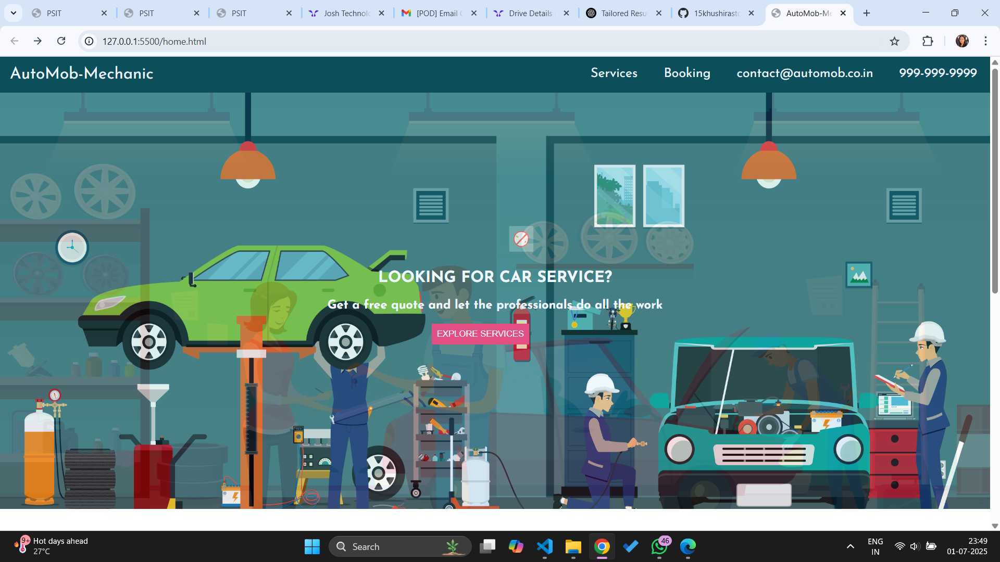
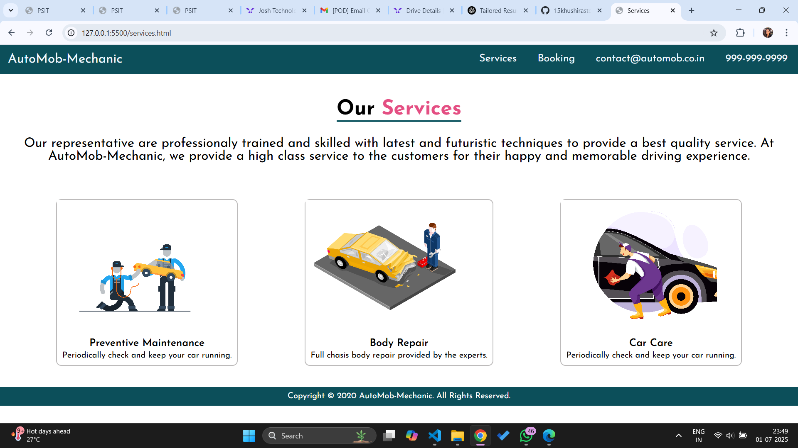
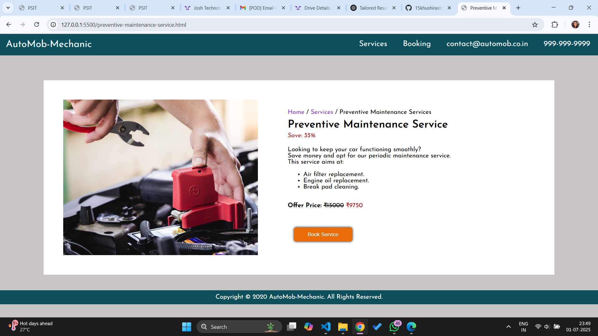
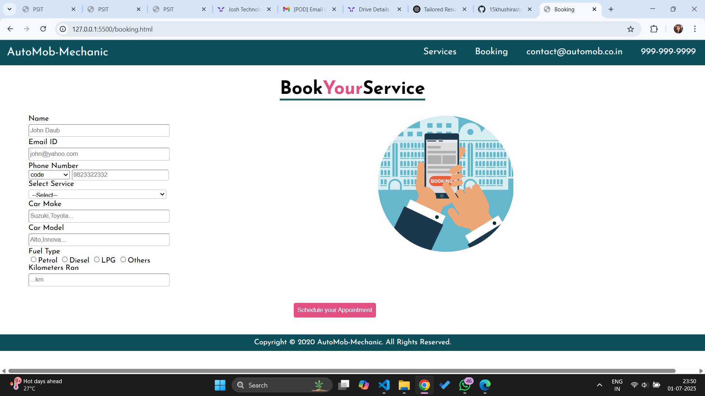

# 🚗 AutoMob-Mechanic – Automobile Services Web App

AutoMob-Mechanic is a responsive and user-friendly web application that allows customers to explore, book, and manage automobile maintenance and repair services online. Designed for ease of access and convenience, it provides real-time interaction with a modern interface for car care solutions.

---

## 🔧 Features

- Explore a variety of car maintenance and repair services
- Book service appointments online
- View appointment history and service details
- Mobile-responsive design for seamless usage
- Intuitive UI built with modern HTML, CSS, and JavaScript

---

## 🛠️ Tech Stack

- HTML5  
- CSS3  
- JavaScript  
- Bootstrap

---

## 🖼️ Screenshots

### 🏠 Homepage

### 🔍 Explore Services

### 🧰 Services Page

### 📋 Book Service

### 📅 Appointment Page

## 📂 Project Structure

AutoMob-Mechanic/
├── index.html
├── services.html
├── bookService.html
├── appointment.html
├── css/
│ └── style.css
├── js/
│ └── script.js
├── screenshots/
│ ├── homepage.png
│ ├── exploreServices.png
│ ├── services.png
│ ├── bookService.png
│ └── appointment.png
└── README.md

## 1. Clone the repository:
   git clone https://github.com/15khushirastogi/AutoMob-Mechanic.git
   
## 2. Navigate to the project folder:
    cd AutoMob-Mechanic
## 3. Open index.html in your browser to explore the app.
